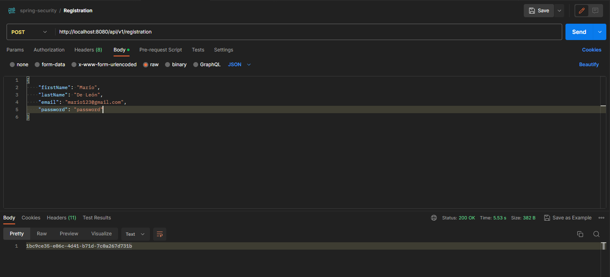

# Login with Spring Security & PostgreSQL

This project is a todo list application that incorporates login authentication and authorization using Spring Security. It also uses PostgreSQL as the database and MailDev for testing the email verification functionality.

## Project Focus

The primary focus of this repository is to provide a robust login system with authentication and authorization using Spring Security and PostgreSQL. While the repository includes a todo list application, the main emphasis is on the login functionality.

If you are looking for the standalone todo list application without login features, you can find it in the separate repository [link to the todo list repository](https://github.com/mario2099/todo-list). This repository focuses on the login system integration into the todo list application.

Please refer to the [todo list repository](https://github.com/mario2099/todo-list) for detailed information on the functionality and usage of the todo list application itself.

## About the Project

I want to make it clear that this project does not attempt to reinvent the wheel. Although the project remains closely aligned with the original repository, it has served as a valuable learning experience. It has allowed me to grasp security concepts that were completely unfamiliar to me before undertaking this project. Adapting the login system to my previous project was a challenging task, but it provided me with a rewarding opportunity to apply and strengthen my skills in this field.

I appreciate the inspiration and knowledge provided by the original repository, which laid the groundwork for this project. Without it, I would not have been able to develop and expand my understanding of web application security.

## Prerequisites

Before running this project, ensure that you have the following prerequisites installed:

- Java Development Kit (JDK) 8 or higher
- Apache Maven
- PostgreSQL
- MailDev (for testing the email verification)
- Postman (for testing registration endpoin)

## Getting Started

Follow these steps to get the project up and running:

1. Clone the repository to your local machine


2. Configure the PostgreSQL Database:

- Install PostgreSQL on your machine if you haven't already.
- Create a new PostgreSQL database for the todo list application.
- Update the `application.properties` file with the appropriate database configuration. Set the `spring.datasource.url`, `spring.datasource.username`, and `spring.datasource.password` properties accordingly.

3. Configure MailDev:

- Install MailDev globally using npm:

  ```
  npm install -g maildev
  ```
- NOTE - you may need to run this previously:

    ```
    Set-ExecutionPolicy Bypass -Scope Process
    ```
- Start MailDev to simulate an email server:

  ```
  maildev
  ```

- MailDev will run on `http://localhost:1080`. You can access the web interface to view received emails.

4. Build the project using Maven:
    ```
   mvn clean install
    ```
5. Run the application 
    ```
   mvn spring-boot:run
    ```

6. The todo list application will now be accessible at `http://localhost:8080` but every endpoint will be secured ayou will be redirected to a login form so you will need to register a user first.


7. To register create a POST request in Postman like next one and if everything is set properly the response will be a confirmation token:
    

8. Next step will be to access to `http://localhost:1080/#/` where the maildev app will be running.


9. Click on the latest email received and after that click on the link `Activate Now` link.


10. Now go back to `http://localhost:8080` and introduce the email and password you registered previously via Postman.


11. Now you have access to the app.

## Project Structure

The project follows a standard Spring Boot project structure, with the main components as follows:

- `src/main/java`: Contains the Java source code for the application.
- `src/main/resources`: Contains the application properties file, views, and static resources.


## Configuration

- The application's configuration can be found in the `application.yml` file.
- You can modify the configuration properties according to your needs, such as the server port, database connection, email server settings, etc.


### POSTMAN CURL
```
curl --location --request POST 'localhost:8080/api/v1/registration' \
--header 'Content-Type: application/json' \
--data-raw '{
    "firstName": "Mario",
    "lastName": "De León",
    "email": "mario123@gmail.com",
    "password": "password"
}'
```

## Credits

This project is based on the tutorial and repository published by Amigoscode, a YouTuber who provides valuable content on software development. The original repository, which served as the foundation for this project, can be found [here](https://youtu.be/QwQuro7ekvc).

I would like to express my gratitude to Amigoscode for their insightful tutorial and the resources they provided, which greatly contributed to the development of this project.


